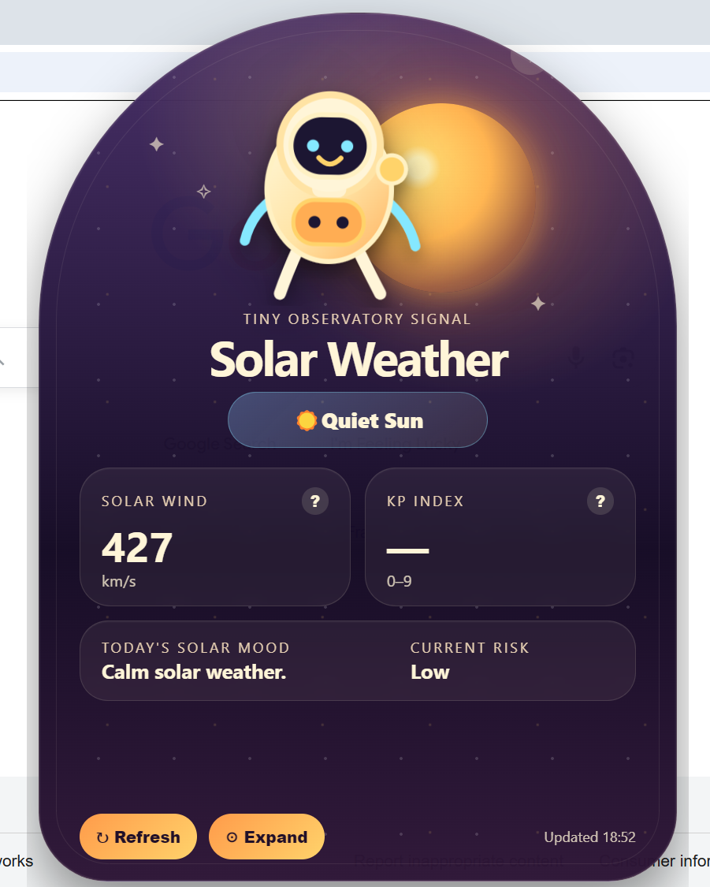
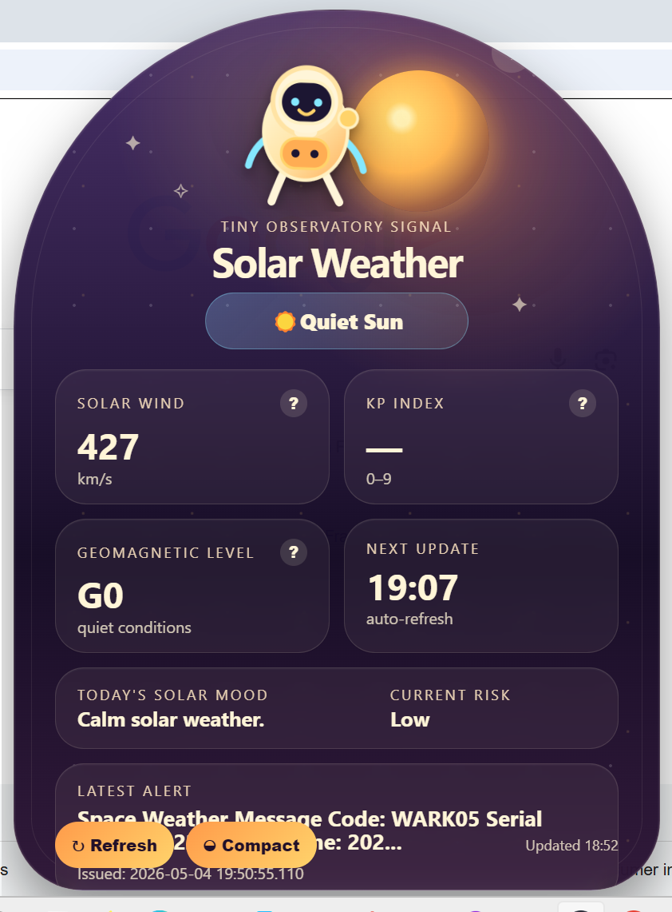
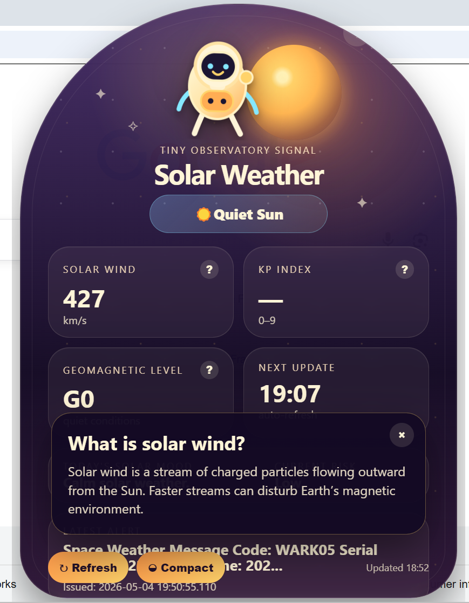

<div align="center">

# 🌞 Solar Weather Observatory Widget

> Compact/expanded mode with visibly changing layout: compact shows the core signal; expanded reveals storm level, next update, latest alert, and educational details.

### A cute Electron desktop widget for live solar wind and geomagnetic activity


</div>

---

## Preview

| Compact Mode | Expanded Mode | Information Mode |
|--------------|--------------|--------------|
|  |  |  |

### Compact Mode

The default observatory view providing a quick overview of current solar weather conditions.

### Expanded Mode

Additional telemetry, alert information, forecast details, and observatory diagnostics.

### Information Mode

Educational popups explaining solar weather concepts including Kp Index, Solar Wind, and Geomagnetic Storms.

---

## Features

- Frameless Electron widget
- Fixed-height layout with no scrolling
- Live NOAA SWPC data attempt
- Offline fallback mode
- Solar wind speed
- Kp index
- Geomagnetic storm level
- Latest alert panel
- Quiet / watchful / stormy / fallback status modes
- Chibi astronaut reaction states
- Refresh, minimize, close, and pin/unpin controls
- Compact / expanded mode
- Educational popups for Kp, solar wind, and geomagnetic storms

---

## Data Sources

The widget attempts to fetch live public products from NOAA SWPC:

```text
https://services.swpc.noaa.gov/products/solar-wind/plasma-1-day.json
https://services.swpc.noaa.gov/products/noaa-planetary-k-index.json
https://services.swpc.noaa.gov/products/alerts.json
```

If the live signal is unavailable, fallback values are displayed and clearly labeled.

---

## How to Run

Use Node.js LTS v22.x.

```powershell
cd "C:\Users\Sabrina\Desktop\solar-weather-observatory-widget-v6\solar-weather-observatory-widget-v6"
npm.cmd install
npm.cmd start
```

PowerShell note: use `npm.cmd`, not `npm`, if `npm.ps1` is blocked.

---

## Troubleshooting

If Electron fails with `path.txt not found` or `Electron failed to install correctly`, check:

```powershell
node --version
```

Use Node.js LTS v22, then reinstall:

```powershell
Remove-Item -Recurse -Force node_modules
del package-lock.json
npm.cmd install
npm.cmd start
```

---

## License

MIT License
